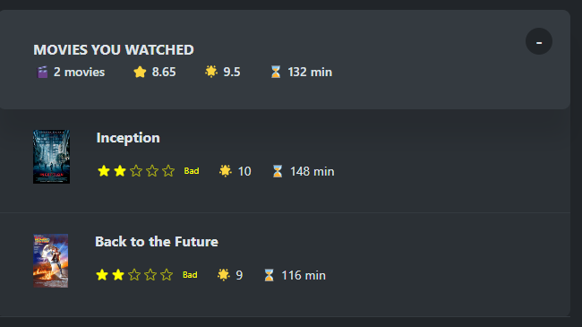

# Star Product Rating

  

## Description

This is the repository for the React component library that enables developers to easily use, edit, tweak, and style a rating functionality for products or services in e-commerce web applications or mobile applications. It is compatible with both JavaScript and TypeScript for the React.js framework.

## Table of Contents

- [Installation](#installation)
- [Usage](#usage)
- [API](#api-documentation)
- [Examples](#examples)
- [Contributing](#contributing)
- [License](#license)
- [Changelog](#changelog)

## Installation

To install the package, use npm or yarn:

bash
```
npm install star-products-rating
```
or 
```
yarn add star-products-rating
```
## Usage
Here's a basic example of how to use the StarRating component:

``` jsx

import React, { useState } from 'react';
import StarProductRating from 'star-product-rating';
import './WatchedMovieCard.css';

const WatchedMovieCard = ({ image, title, imbRating, userRating, watchTime }) => {
    const [storedRating, setStoredRating] = useState(2);

    return (
        <div className='wm-card-container'>
            
            <div className="wm-card-text-wrapper">
                <h4 className="wm-card-text1">{title}</h4>
                <div className="wm-card-text2-wrapper">
                    <StarProductRating 
                        size={16} 
                        starLength={5} 
                        color='yellow' 
                        messages={['Terrible', 'Bad', 'Okay', 'Good', 'Amazing']}  
                        starTextStyle={{ fontSize: "10px", color: "yellow" }} 
                        defaultRating={storedRating} 
                        newRating={setStoredRating} 
                        disabled 
                    />
                    <p className="wm-card-text2">🌟 {userRating}</p>
                    <p className="wm-card-text2">⌛ {watchTime} min</p>
                </div>
            </div>
        </div>
    )
}

export default WatchedMovieCard;

```

## Image 
### The stars on the left of the movies is what the component looks like



## API Documentation

### `StarRating` Component

| Prop           | Type      | Default    | Description                             |
|----------------|-----------|------------|-----------------------------------------|
| `starLength`   | `number`   | `5`        | Number of stars to display              |
| `color`        | `string`   | `#000000`  | Color of the stars                      |
| `size`         | `number`   | `24`       | Size of each star                       |
| `disabled`     | `boolean`  | `false`    | Disable interaction with the stars      |
| `starStyle`    | `object`   | `{}`       | Custom styles for the star container    |
| `starTextStyle`| `object`   | `{}`       | Custom styles for the rating text       |
| `messages`     | `array`    | `['Terrible', 'Bad', 'Okay', 'Good', 'Amazing']` | Array of rating messages         |
| `defaultRating`| `number`   | `1`        | Default rating value                   |
| `newRating`    | `function` |           | Callback function for rating change     |


## Examples
### Disabled Stars
#### This is to only display the rating data of a user fetched from a database and disable user input

```jsx
<StarRating
  starLength={5}
  color="#FFD700"
  size={24}
  disabled={true}
  newRating={handleNewRating}
/>
```


## Custom Star Style

``` jsx
<StarRating
  starLength={5}
  color="#FFD700"
  size={24}
  starStyle={{ display: 'flex', alignItems: 'center', gap: '5px' }}
  newRating={handleNewRating}
/>
```

## Contributing
We welcome contributions to Star Product Rating! Please follow these steps:

- Fork the repository.
- Create a new branch (git checkout -b feature/YourFeature).
- Commit your changes (git commit -am 'Add new feature').
- Push to the branch (git push origin feature/YourFeature).
- Create a new Pull Request.

## License
This project is licensed under the MIT License.

## Changelog
[1.0.2] - 2024-09-11
Fixed React type declarations and updated README.

[1.0.0] - 2024-09-10
Initial release.


